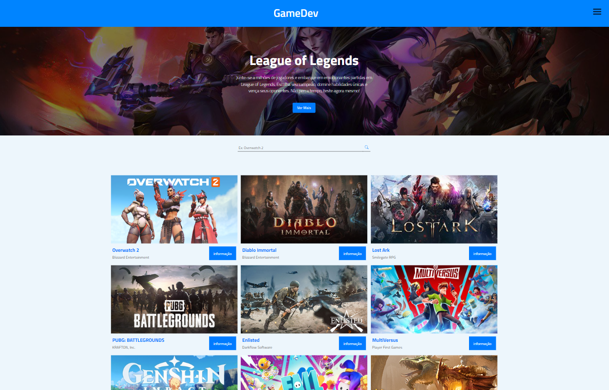
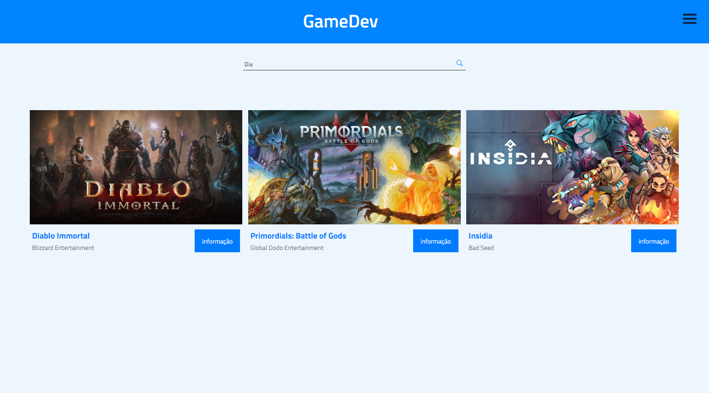

# Dependencias 
- npm i -g typescript

# Instalação e uso
- npm install
- npm run dev

# Bibliotecas usadas
- Styled-components
- React-Router-Dom
- React-Icons
- React-Query
- Axios

#Descrição do projeto e minha analise pessoal

    Neste projeto, foi requisitado que eu utilizasse uma API de jogos e implementasse várias funcionalidades adicionais para o 
    site, incluindo: a criação de contas de usuário, a possibilidade de os usuários criarem suas listas de jogos através de um 
    botão de favoritos, a capacidade de realizar avaliações de jogos, além do tratamento de erros intencionais retornados pela 
    API durante as requisições. Também foi solicitada a implementação de uma função de busca e filtros para melhorar a navegação
    e a experiência do usuário no site.

<b>Meu relatorio do projeto</b>

    Durante o período de recesso da faculdade, participei deste processo seletivo com bastante disponibilidade para dedicar-me a ele. 
    Investi total atenção em cada detalhe solicitado, passando praticamente o dia inteiro na frente do computador durante as duas semanas
    das primeiras etapas da seleção. Apesar de não ter avançado para a terceira etapa, fiquei muito satisfeito com os resultados obtidos. 
    Foi um período de aprendizado intenso e rápido sobre diversos temas, e recebi elogios da direção do processo seletivo, destacando-me 
    entre os concorrentes. Infelizmente, um erro simples acabou me custando a continuidade: na minha aplicação, os jogos estavam sendo 
    adicionados à lista de favoritos mesmo sem serem favoritados, apenas por receberem avaliações.

#Imagens do projeto

- Home
<h1>
    
</h1>
- Game Page
<h1>
    
</h1>
- Area de Busca
<h1>
    
</h1>

